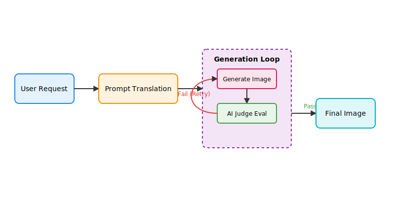
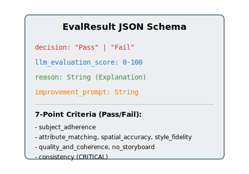

# Image Generation Process

This document provides a comprehensive "soup-to-nuts" explanation of the image generation process within this project. It outlines how a user's initial request is translated, how the generation loop functions, and the strict criteria used by the AI judge to evaluate the output.

## High-Level Workflow

At a high level, the image generation process consists of three main phases:
1. **Prompt Translation:** The agent enriches the user's prompt with context and constraints.
2. **Generation Loop:** The system requests an image from the model, handling concurrency and retries.
3. **Evaluation:** An AI judge evaluates the image against strict criteria. If it fails, an `improvement_prompt` is fed back into the generation loop.

---

## Phase 1: Prompt Translation

When a user requests an image (e.g., "Create a storyboard for the Sapphire Reserve"), the request is first processed by the marketing agent (via [`tools_media.py`](../../marketing-agent/app/tools_media.py)).

1. **Agent Context:** The agent applies systemic constraints (defined in [`prompt.md`](../../marketing-agent/app/prompt.md) and brand guidelines). It ensures that the generated visual will include necessary branding, personas, and adheres to strict stylistic rules (e.g., Chase Sapphire Reserve guidelines).
2. **Translation:** The LLM translates the high-level user request into a highly descriptive `image_prompt`. 
3. **Reference Aggregation:** Any provided reference images (for character consistency or product details) are aggregated and passed along as byte payloads.

---

## Phase 2: The Generation Loop

The core orchestration happens within [`gemini_utils.py`](../../marketing-agent/app/adk_common/utils/gemini_utils.py) via the [`generate_and_select_best_image`](../../marketing-agent/app/adk_common/utils/gemini_utils.py#L131) function. This function isn't just a simple API call; it's a robust retry loop designed to ensure quality.

### Key Mechanisms:
- **Concurrency Limits:** It uses `asyncio.Semaphore` based on the `IMAGE_GENERATION_CONCURRENCY_LIMIT` environment variable to prevent overwhelming the API.
- **Payload Construction:** The initial `contents` array is built using the translated text `prompt` and any `input_images` (reference images).
- **The Retry Loop:** The loop executes up to `IMAGE_GENERATION_EVAL_REATTEMPTS + 1` times.
- **Model Interaction:** It calls [`_call_gemini_image_api`](../../marketing-agent/app/adk_common/utils/gemini_utils.py#L275), which uses the Gemini client to generate the image bytes. This API call itself is wrapped with tenacity retries to handle `429 RESOURCE_EXHAUSTED` errors.

---

## Phase 3: The Evaluation Process

Once an image is generated, it immediately undergoes scrutiny by an "AI Judge" in [`evaluate_media.py`](../../marketing-agent/app/adk_common/utils/evaluate_media.py#L86) if `should_evaluate` is true.

### 1. The Internal Prompt Construction
The system dynamically builds an evaluation prompt ([`get_image_evaluation_prompt`](../../marketing-agent/app/adk_common/utils/evaluation_prompts.py#L23) in [`evaluation_prompts.py`](../../marketing-agent/app/adk_common/utils/evaluation_prompts.py)). It feeds the **Original User Prompt**, the **Generated Image**, and descriptions of the **Reference Images** to a separate Gemini evaluation model (`LLM_GEMINI_MODEL_EVALUATION`).

### 2. The 7-Point Criteria
The AI judge is instructed to evaluate the image against seven strict criteria. A single failure means the entire image fails:
1. **Core Subject Adherence:** Are the primary subjects present?
2. **Critical Attribute Matching:** Are colors, numbers, and text legible and correct?
3. **Spatial and Relational Accuracy:** Are objects positioned correctly relative to each other?
4. **Style and Medium Fidelity:** Does the mood/style match? (Default is hyper-realistic).
5. **Image Quality and Coherence:** Are there technical flaws, distortions, or anatomical errors?
6. **No Storyboard/Collage:** Is it a single cohesive scene? (Unless explicitly requested).
7. **Consistency (CRITICAL):** Does the image strictly match reference images (character identity, product details)?

### 3. Structured JSON Output
The evaluation model is forced to output a strictly typed JSON object (`EvalResult`).

### 4. The Feedback Loop
If the decision is `"Fail"`, the generation loop in Phase 2 intercepts the `improvement_prompt` from the JSON payload. 

The loop appends this string to the context for the next iteration: 
> *"An image was already generated and the evaluator deemed it did not pass quality and suggested the following to improve the image: {improvement_prompt}"*

This self-correcting cycle repeats until either an image passes the evaluation, or the maximum number of eval retries is reached. If the maximum is reached, it returns the image that received the highest `averaged_evaluation_score`.